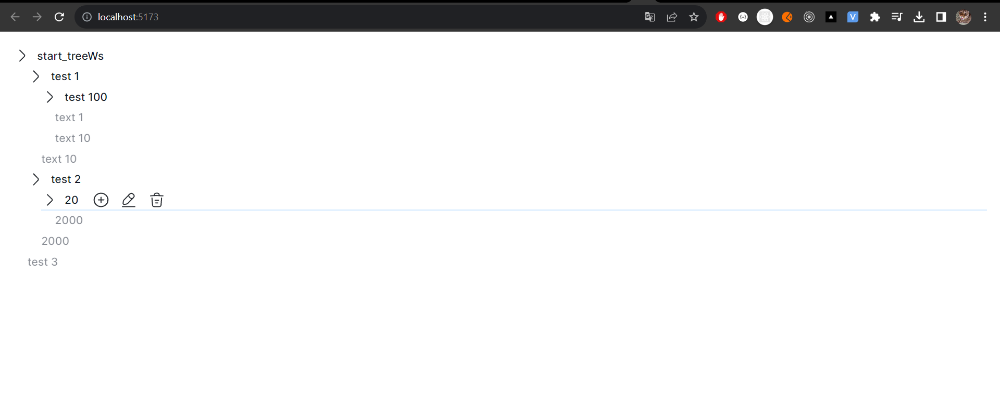
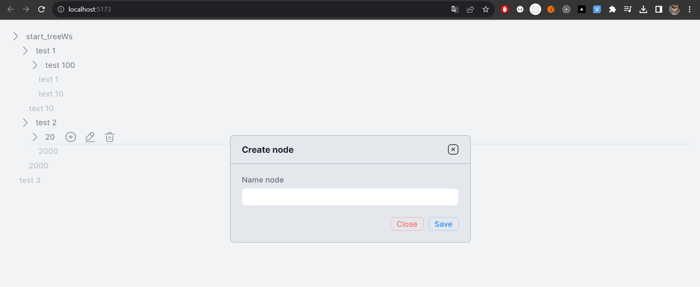

# Тестовое задание.

## Требования:
1. Требуется разработать дерево компонент.
2. Требуется использовать Swagger https://test.vmarmysh.com/swagger/user.html .
3. Требуется реализовать CRUD операции.
4. Требуется использовать технологию React.

## Инструкцию для локального запуска проекта

1. pnpm install

## Stack:
- React
- Typescript
- Axios
- radix-ui
- IDE- WebStorm
